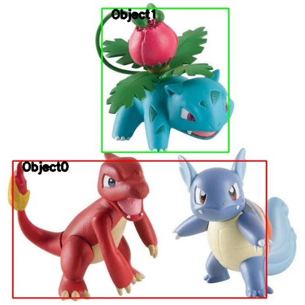

# Harris-corner-detection-and-K-means-clustering
**This project aims to use the Harris corner detection technique to find the
data points (key points) of an image and perform the K-means clustering
technique using the strongest 100 points.**

Harris corner detection technique detects the corners in the image, which are
large variations in intensity in all the directions. I used a modified version
of this technique called Shi-Tomasi Corner Detector. In the Shi-Tomasi method,
the scoring function of the Harris Corner Detector has been improved by
considering a minimum threshold. To implement this method, I used function
cv2.goodFeaturesToTrack(gray_img, maxc, Q, minD) which its parameters are as
follow:

Parameters:

**gray_img** – Grayscale image with integral values

**maxc** – Maximum number of corners we want (give negative value to get all the
corners)

**Q** – Quality level parameter (preferred value=0.01)

**maxD** – Maximum distance (preferred value=10)

The result is shown in the figure below.

*Original image’s key points*

**K-means clustering technique using the strongest 100 points**

To implement K-means clustering on key points, I followed the K-means algorithm
steps as follow:

K means clustering algorithm steps:

1.  Choose the number of clusters, e.g., k=3.

2.  Choose the same number of random key points as initial centroids.

3.  Calculate the distance of each data point from the centroids.

4.  Allocate the data point to a cluster where its distance from the centroid is
    minimum.

5.  Recalculate the new centroids based on the closest point, the mean of each
    cluster.

6.  Repeat steps 3 to 5 till no data point changes its cluster.

**• Let’s compare the outcomes of multiple runs with different values for K and
choose the best one based on a predefined criterion.**

In the table below, you can see the seven iterations of the first 22 key points.

*Seven iterations of the first 22 key points (format: [x, y, cluster \#,
distance])*

The number of iterations depends on the number of clusters and the position of
initial centroids, so, as you can see in the number of iterations for different
runs where k=3.

*Number of iterations for the different runs (k=3)*

The below figures show the clusters for various k.

|  |  |
|--------------------------------------------------|--------------------------------------------------|
| K=2                                              | K=3                                              |
|  |  |
| K=4                                              | K=5                                              |
|  |                                                  |
| K=6                                              |                                                  |

*clusters for various k*

We expect to achieve the best-detected cluster when we consider k=3 since we
have three objects in the selected photo.

>   ****

>   *The best-detected clusters*

We can draw a bounding box for each cluster of the data points.

I used two methods for drawing a bounding box for each cluster:

In the first method, I considered the minimum and maximum value of x^2+y^2 for each
cluster, then drew the bounding box using function cv2.rectangle(image,
start_point, end_point, color, thickness) which its parameters are as follow:

Parameters:

**image**: It is the image on which a rectangle is to be drawn.

**start_point**: It is the starting coordinates of the rectangle. The
coordinates are represented as tuples of two values, i.e. (X coordinate value, Y
coordinate value).

**end_point**: It is the ending coordinates of the rectangle. The coordinates
are represented as tuples of two values, i.e. (X coordinate value, Y coordinate
value).

**color**: It is the color of the borderline of a rectangle to be drawn. For
BGR, we pass a tuple. eg: (255, 0, 0) for blue color.

**thickness**: It is the thickness of the rectangle borderline in px. The
thickness of -1 px will fill the rectangle shape by the specified color.

**Return Value**: It returns an image.

The results are shown in the figures below:

|  |  |
|--------------------------------------------------|--------------------------------------------------|
| K=2                                              | K=3                                              |
|  |  |
| K=4                                              | K=5                                              |
|  |                                                  |
| K=6                                              |                                                  |

*bounding box considering the minimum and maximum value of x^2+y^2 for each cluster*

In the second method, I considered the minimum and maximum value of for each
cluster ([xmin, ymin], [xmax, ymax]), then drew the bounding box using function
cv2.rectangle. The results are shown in the figures below:

|  |  |
|--------------------------------------------------|--------------------------------------------------|
| K=2                                              | K=3                                              |
|  |  |
| K=4                                              | K=5                                              |
|  |                                                  |
| K=6                                              |                                                  |

*bounding box considering the minimum and maximum value of  for each cluster
([xmin, ymin], [xmax, ymax])*

**References:**

<https://medium.com/machine-learning-algorithms-from-scratch/k-means-clustering-from-scratch-in-python-1675d38eee42>

<https://www.simplilearn.com/tutorials/machine-learning-tutorial/k-means-clustering-algorithm>

<https://towardsdatascience.com/k-means-clustering-with-python-code-explained-5a792bd19548>

<https://realpython.com/k-means-clustering-python/>

<https://www.geeksforgeeks.org/python-corner-detection-with-shi-tomasi-corner-detection-method-using-opencv/>

<https://www.geeksforgeeks.org/python-opencv-cv2-rectangle-method/>

